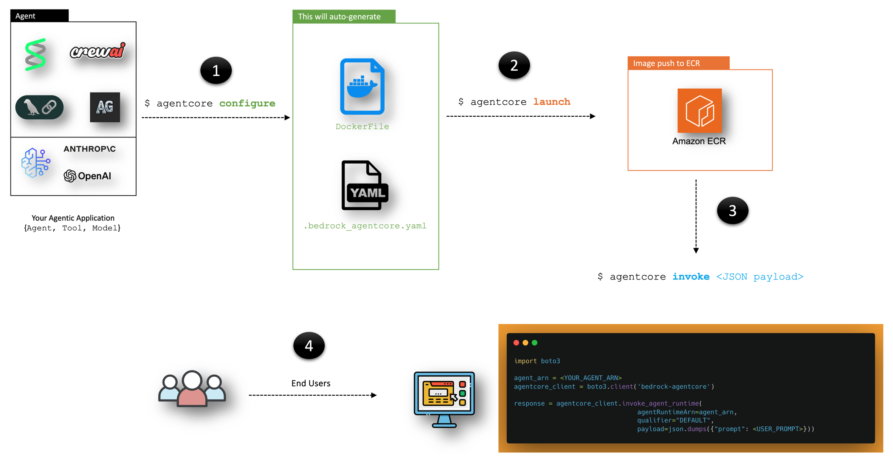

# Amazon Bedrock AgentCore Runtime

## Overview
Amazon Bedrock AgentCore Runtime is a secure, serverless runtime designed for deploying and scaling AI agents and tools. 
It supports any frameworks, models, and protocols, enabling developers to transform local prototypes into production-ready solutions with minimal code changes.

An AgentCore Runtime is the foundational component that hosts your AI agent or tool code. It represents a containerized application that processes user inputs, maintains context, and executes actions using AI capabilities. When you create an agent, you define its behavior, capabilities, and the tools it can access. For example, a customer support agent might answer product questions, process returns, and escalate complex issues to human representatives.

You can build and deploy agents to AgentCore Runtime using the AgentCore Python SDK or directly through AWS SDKs. With the Python SDK, you can define your agent using popular frameworks like LangGraph, CrewAI, or Strands Agents. The SDK handles infrastructure complexities, allowing you to focus on the agent's logic and capabilities.

Amazon BedrockAgentCore Python SDK provides a lightweight wrapper that helps you deploy your agent functions as HTTP services that are compatible with Amazon Bedrock. It handles all the HTTP server details so you can focus on your agent's core functionality.

All you need to do is decorate your function with the `@app.entrypoint` decorator and use the `configure` and `launch` capabilities of the SDK to deploy your agent to AgentCore Runtime. Your application is then able to invoke this agent using the SDK or any of the AWS's developer tools such as boto3, AWS SDK for JavaScript or the AWS SDK for Java.

## Key Features

### Framework and Model Flexibility

- Deploy agents and tools from any framework (such as Strands Agents, LangChain, LangGraph, CrewAI) 
- Using any model (in Amazon Bedrock or not)

### Integration

Amazon Bedrock AgentCore Runtime integrates with other Amazon Bedrock AgentCore capabilities through a unified SDK, including:

- Amazon Bedrock AgentCore Memory
- Amazon Bedrock AgentCore Gateway
- Amazon Bedrock AgentCore Observability
- Amazon Bedrock AgentCore Tools

This integration aims to simplify the development process and provide a comprehensive platform for building, deploying, and managing AI agents.

